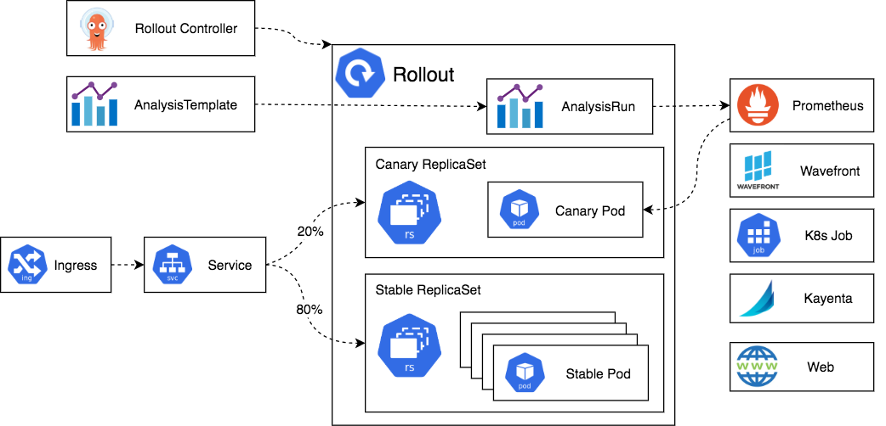

# Architecture

[Back to README](../README.md)

* **Rollouts controller** - main controller that monitors the cluster for events and reacts whenever a resource of type `Rollout` is changed. The controller will read all the details of the rollout and bring the cluster to the same state as described in the rollout definition
* **Replica sets for old and new version** - instances of the standard Kubernetes ReplicaSet resources. Argo Rollouts puts some extra metadata on them in order to keep track of the different versions that are part of an application
* **Ingress/Service** - is the mechanism that traffic from live users enters your cluster and is redirected to the appropriate version. Argo Rollouts use the standard Kubernetes service resource, but with some extra metadata needed for management
* **Analysis** - is the capability to connect a Rollout to your metrics provider and define specific thresholds for certain metrics that will decide if an update is successful or not. For each analysis you can define one or more metric queries along with their expected results. A Rollout will progress on its own if metric queries are good, rollback automatically if metrics show failure and pause the rollout if metrics cannot provide a success/failure answer.
  * For performing an analysis, Argo Rollouts includes two custom Kubernetes resources: `AnalysisTemplate` and `AnalysisRun`:
    * `AnalysisTemplate` - contains instructions on what metrics to query
    * `AnalysisRun` - the actual result that is attached to a Rollout
  * Using an analysis and metrics in a Rollout is completely optional
  * You can manually pause and promote a rollout or use other external methods (e.g. smoke tests) via the API or the CLI
  * You don't need a metric solution just to use Argo Rollouts. You can also mix both automated (i.e. analysis based) and manual steps in a Rollout
  * Apart from metrics, you can also decide the success of a rollout by running a Kubernetes job or running a webhook
* **Metric providers** - [many providers](https://argoproj.github.io/argo-rollouts/features/analysis/) are supported OOTB that you can use in the Analysis resources to automatically promote or rollback a rollout
* **CLI and UI** - view and manage Rollouts using web or CLI
